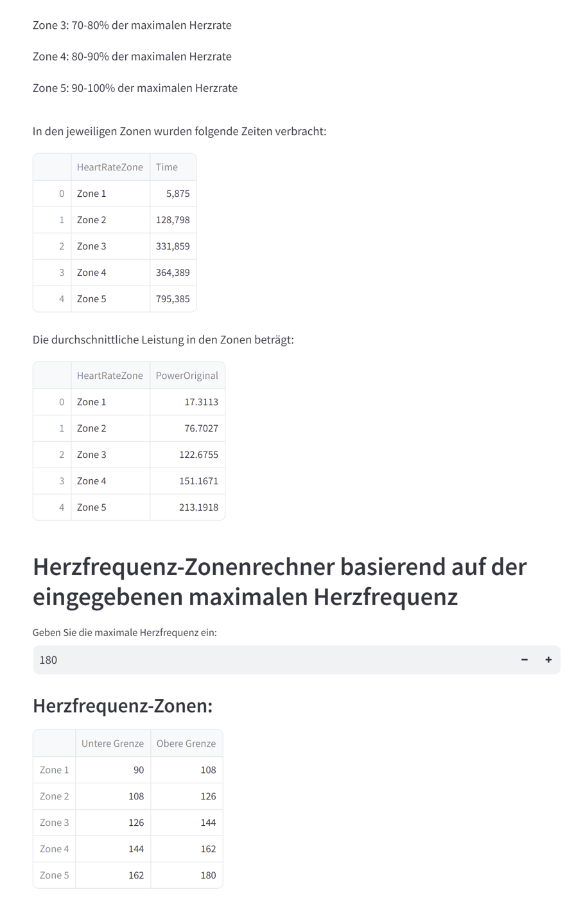

# Herzfrequenz-Analyse mit Streamlit
Dieses Repository enthält eine Streamlit-App zur Analyse von Leistungstestdaten. Die App ermöglicht es Benutzern, eine interaktive Visualisierung der Leistung und Herzfrequenz über die Zeit zu erstellen, die Leistung in verschiedenen Herzfrequenz-Zonen anzuzeigen und die Zeit in jeder Zone zu berechnen.

# Wie man die App startet
1. Stellen Sie sicher, dass Sie Python und Streamlit installiert haben.
2. Klone dieses Repository auf Ihren lokalen Rechner.
3. Navigieren Sie in Ihrem Terminal zum Verzeichnis der heruntergeladenen Dateien.
4. Installieren Sie die erforderlichen Bibliotheken aus der `requirements.txt`-Datei, indem Sie pip install `-r requirements.txt` ausführen.
5. Starten Sie die Streamlit-App, indem Sie `streamlit run main.py` ausführen.
6. Öffnen Sie den angezeigten Link in Ihrem Browser, um die App zu verwenden.

# Funktionalitäten
Die Streamlit-App bietet folgende Funktionen:

- EKG-Data: Zeigt einen interaktiven Plot von Leistung und Herzfrequenz über die Zeit.
- Power-Data: Hier können weitere Analysen und Visualisierungen der Leistungsdaten durchgeführt werden.
- Auswertung: Zeigt statistische Auswertungen wie den Mittelwert und Maximalwert der Leistung sowie die Aufteilung der Aktivität in Herzfrequenz-Zonen und die durchschnittliche Leistung in den Zonen an.

# Zusätzliche Hinweise
- Die Analysefunktionen sind in der Datei auswerten.py implementiert und werden von der Hauptdatei main.py verwendet.
- Die Herzfrequenz-Zonen werden dynamisch berechnet, basierend auf der vom Benutzer eingegebenen maximalen Herzfrequenz.

# Screenshots

